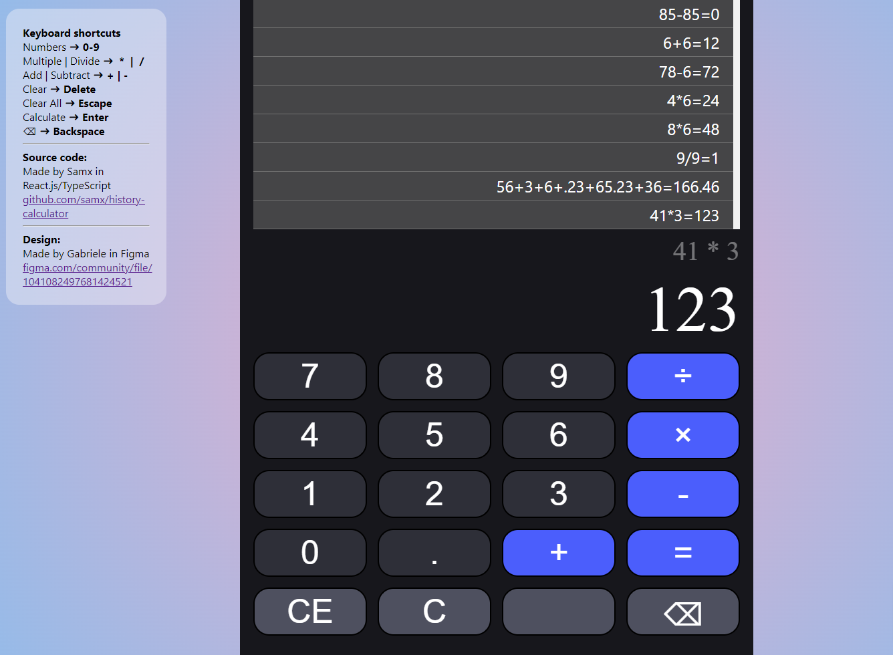

# History Calculator - React.js/TypeScript

Standard calculator app with calculations saved to a history list using localstorage. Includes keyboard shortcuts.

How the app with built
* React v18.2.0 (functional components with hooks)
* TypeScript
- Redux (with Redux persist to save state history in localstorage)
- Styled Components (with design converted from Figma template)
- Jest

Todos
* Convert the redux files to use TypeScript
* Write unit tests

Deployed on Netlify 
https://tinyurl.com/ReactHistoryCalculator

Figma design template
https://www.figma.com/community/file/1041082497681424521

Made with create react app. Old readme found here.[Old README](README.old.md).